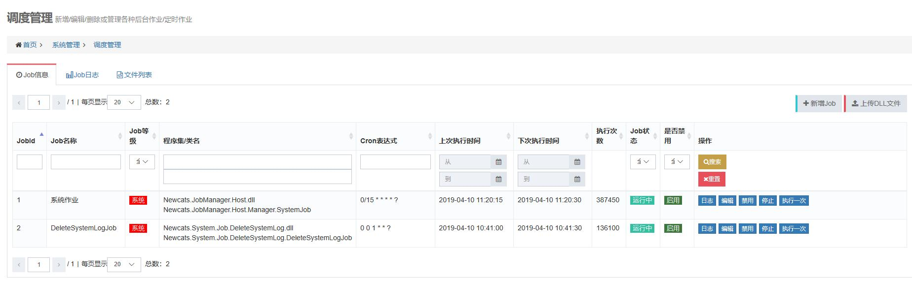
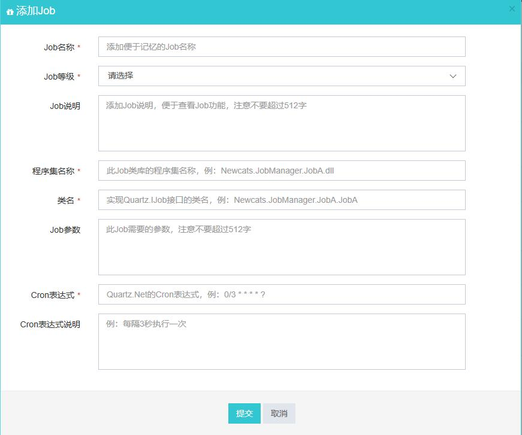

# Newcats.JobManager
[](https://dotnet.microsoft.com/download)
[](https://dotnet.microsoft.com/download)
[](https://www.microsoft.com/en-us/cloud-platform/windows-server)
[](https://github.com/newcatshuang/JobManager/blob/master/LICENSE)

README: [中文](https://github.com/newcatshuang/JobManager/blob/master/README.md) | [English](https://github.com/newcatshuang/JobManager/blob/master/README-en.md)

---

Newcats.JobManager是一个基于QuartzNet3.0构建的简易任务调度平台。整个方案使用**QuartzNet/Topshelf/.NET Core Generic Host/Asp.net Core WebApi**等技术开发，主要分为管理端和服务端。管理端主要为对job信息的数据库记录进行CRUD操作，上传DLL文件，查看日志，查看文件等，主要通过Asp .net Core WebApi进行。服务端为一个Windows Service，由Topshelf承载，负责具体QuartzJob的调度，轮询数据库的job记录，并根据不同的状态对job进行管理。



---

## 功能特色

1. 服务端和管理端分离
2. 支持QuartzNet的秒级任务
3. Job信息持久存储
4. 全部技术基于 .Net Core/.Net Standard
5. 网页端统一管理

---

## 项目结构


* [Newcats.JobManager.Api](https://github.com/newcatshuang/JobManager/tree/master/src/Newcats.JobManager.Api) 管理端WebApi（不包含UI），job信息的CRUD操作，上传DLL文件，查看日志，查看文件等操作在此项目实现
* [Newcats.JobManager.Host](https://github.com/newcatshuang/JobManager/tree/master/src/Newcats.JobManager.Host) 服务端Windows Service，调度器对QuartzJob进行调度及各种管理在此实现
* [Newcats.JobManager.Common](https://github.com/newcatshuang/JobManager/tree/master/src/Newcats.JobManager.Common) 公共类库，公用的实体、方法等
* [Newcats.System.Job.DeleteSystemLog](https://github.com/newcatshuang/JobManager/tree/master/src/Newcats.System.Job.DeleteSystemLog) 示例项目，NetStandard类库项目。命名规则为```Newcats.System.Job.XXX/Newcats.Business.Job.XXX/Newcats.Test.Job.XXX```

---

## 运行环境

使用Windows Server 2012及以上的服务器版本，安装.NET Core2.2 Runtime及以上的运行时，安装IIS服务。

---

## 发布部署

* **`Newcats.JobManager.Api`** VS右键->发布->配置:Release/目标框架:netcoreapp2.2/部署模式:框架依赖/目标运行时:可移植
* **`Newcats.JobManager.Host`** 使用dotnet命令发布 ```dotnet publish -c Release -r win-x64```
* **`Newcats.System.Job.DeleteSystemLog`** 直接Release模式编译,生成类库dll即可

1. 修改并执行`/doc/1.Database Scripts.sql`SQL脚本
2. 新建JobManager文件夹,里面包含2个子文件夹JobApi,JobHost
3. 把上面发布生成的Newcats.JobManager.Api项目文件拷贝到JobApi里面,即JobApi文件夹为api站点的根目录
4. 把上面生成的Newcats.JobManager.Host项目文件拷贝到JobHost里面,即JobHost为host的主目录
5. 目录树显示如下:

```cmd
JobManager
│  
├─JobApi
│      ......
│      Newcats.JobManager.Api.dll
│      web.config
│      ......
└─JobHost
        ......
        Newcats.JobManager.Common.dll
        Newcats.JobManager.Common.pdb
        Newcats.JobManager.Host.deps.json
        Newcats.JobManager.Host.dll
        Newcats.JobManager.Host.exe
        Newcats.JobManager.Host.pdb
        Newcats.JobManager.Host.runtimeconfig.json
        Newtonsoft.Json.dll
        Quartz.dll
        Topshelf.dll
        TopShelf.ServiceInstaller.dll
        ucrtbase.dll
        WindowsBase.dll
        ......
```

6. api站点使用IIS部署
7. host端使用cmd命令进行安装,管理员权限打开cmd  
  `C:\WINDOWS\system32>cd\`切换目录  
  `C:\>D:\JobManager\JobHost\Newcats.JobManager.Host.exe install` 安装服务  
  `C:\>D:\JobManager\JobHost\Newcats.JobManager.Host.exe start` 启动服务  
  `C:\>D:\JobManager\JobHost\Newcats.JobManager.Host.exe stop` 停止服务  
  `C:\>D:\JobManager\JobHost\Newcats.JobManager.Host.exe uninstall` 卸载服务  

```cmd
Microsoft Windows [版本 10.0.17763.437]
(c) 2018 Microsoft Corporation。保留所有权利。

C:\Windows\system32>cd\

C:\>D:\JobManager\JobHost\Newcats.JobManager.Host.exe install
Configuration Result:
[Success] Name JobManagerHostServer
[Success] DisplayName 作业调度服务
[Success] Description 作业调度管理器的托管服务
[Success] ServiceName JobManagerHostServer
Topshelf v4.2.0.194, .NET Framework v4.0.30319.42000

Running a transacted installation.

Beginning the Install phase of the installation.
Installing 作业调度服务 service
Installing service JobManagerHostServer...
Service JobManagerHostServer has been successfully installed.

The Install phase completed successfully, and the Commit phase is beginning.

The Commit phase completed successfully.

The transacted install has completed.
```

```cmd
C:\>D:\JobManager\JobHost\Newcats.JobManager.Host.exe start
Configuration Result:
[Success] Name JobManagerHostServer
[Success] DisplayName 作业调度服务
[Success] Description 作业调度管理器的托管服务
[Success] ServiceName JobManagerHostServer
Topshelf v4.2.0.194, .NET Framework v4.0.30319.42000
The JobManagerHostServer service was started.
```

```cmd
C:\>D:\JobManager\JobHost\Newcats.JobManager.Host.exe stop
Configuration Result:
[Success] Name JobManagerHostServer
[Success] DisplayName 作业调度服务
[Success] Description 作业调度管理器的托管服务
[Success] ServiceName JobManagerHostServer
Topshelf v4.2.0.194, .NET Framework v4.0.30319.42000
The JobManagerHostServer service was stopped.
```

```cmd
C:\>D:\JobManager\JobHost\Newcats.JobManager.Host.exe uninstall
Configuration Result:
[Success] Name JobManagerHostServer
[Success] DisplayName 作业调度服务
[Success] Description 作业调度管理器的托管服务
[Success] ServiceName JobManagerHostServer
Topshelf v4.2.0.194, .NET Framework v4.0.30319.42000


The uninstall is beginning.
Uninstalling JobManagerHostServer service
Service JobManagerHostServer is being removed from the system...
Service JobManagerHostServer was successfully removed from the system.

The uninstall has completed.

C:\>JobHost\
```

8. 打开服务管理-选择属性-选择恢复,第一次失败/第二次失败都选择 *重新启动服务*  


---

## 使用说明

1. 在JobItems目录下面,新建NetStandard 2.0的类库项目
2. 引用QuartzNet包, **`注意,版本号一定要和Host里面的版本一致(即和服务器版本一致)`**  
`Install-Package Quartz -Version 3.0.7`
3. 新建类,实现`IJob`接口,业务逻辑写在`Execute`方法里面

```CSharp
    /// <summary>
    /// 删除一个月前的JobLevel.System级的JobLog
    /// </summary>
    public class DeleteSystemLogJob : IJob
    {
        public Task Execute(IJobExecutionContext context)
        {
            new DeleteService().DeleteSystemLog();
            return Task.CompletedTask;
        }
    }
```

4. Release模式编译生成此类库项目的dll文件
5. 在网页管理端,点击`上传DLL文件`按钮,选择此项目有关的DLL文件(服务器已有的,未修改dll文件可以不上传)  

6. 点击`新增Job`按钮,弹出模态框,填写相关的Job信息  

7. 刷新页面,在`Job信息`列表里找到刚刚添加的Job,点击启动,就可以将Job添加到调度器了
8. `Job日志`如下:  

9. `文件列表`如下:  


---

## 操作说明

* **`日志`** 查看最近的20条运行日志
* **`编辑`** 修改Job信息,如果改了类名/程序集名/Cron表达式,需要先停止再启动,才能生效
* **`启用`** 把处于禁止状态的Job改为启用
* **`禁用`** 需要先停止,再禁用,禁用的Job不会再加入调度器
* **`启动`** 启动Job,如果不存在,会重新加入调度器
* **`停止`** 停止Job,会从调度器删除
* **`执行一次`** 不管调度计划如何,立即执行一次Job

---

## 注意事项

* **`各个项目里面引用的包,一定要使用相同的版本号,必需和服务器使用的版本号一致`**
* **`升级项目的包版本一定要统一进行,更新服务器的所有包`**
* **`上传文件时,如果遇到同名文件,会先删除然后替换,一定注意`**

---

## 参考

* [mamingbo/Only.Jobs](https://github.com/mamingbo/Only.Jobs)
* [Asp.Net Core2.0 基于QuartzNet任务管理系统](http://www.cnblogs.com/miskis/p/8487634.html)
* [ZeroTwL/QuartzNetJob](https://github.com/ZeroTwL/QuartzNetJob)

---

## 贡献与反馈

> 如果你在阅读或使用任意一个代码片断时发现Bug，或有更佳实现方式，欢迎提Issue。 

> 对于你提交的代码，如果我们决定采纳，可能会进行相应重构，以统一代码风格。 

> 对于热心的同学，将会把你的名字放到**贡献者**名单中。  

---

## 免责声明

* 虽然代码已经进行了高度审查，并用于自己的项目中，但依然可能存在某些未知的BUG，如果你的生产系统蒙受损失，本人不会对此负责。
* 出于成本的考虑，将不会对已发布的API保持兼容，每当更新代码时，请注意该问题。

---

## 协议
[MIT](https://www.newcats.xyz/license.html) © Newcats

---

## 作者: newcats-2019/04/10